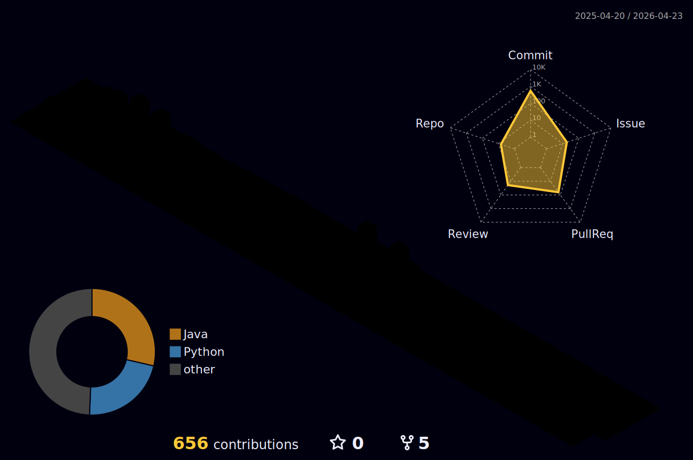

<!--header-->


### INFO

[](https://git.io/typing-svg)


### Skills & Tools
<div align="center">


<!--


-->


</div>


### Contact
<br clear="both">
<div align="center">

[](https://github.com/jyc0011)
[](https://blog.naver.com/jyc001121)
[](mailto:jyc0011211@gmail.com)
[](https://acoustic-colby-a4a.notion.site/1783b1d2fb5e807186b5eb8c2bb0ac99)
[](https://discord.gg/4JJcuyDp)
[](https://velog.io/@jyc0011/posts)
</div>

### Stats

<div align="center">

[](https://solved.ac/jyc0011)
  

[](https://github.com/jyc0011/github-readme-stats)
[](https://github.com/jyc0011)


</div>

<details>
 
<summary>waka Time</summary>
 
<!--START_SECTION:waka-->


**🐱 저의 GitHub 정보에요.** 

> 📦 GitHub의 98.4 kB만큼의 저장소를 사용하고 있어요. 
 > 
> 🏆 755 만큼의 Contributions을 2025년에 했어요
 > 
> 🚫 구직중이지 않아요.
 > 
> 📜 18개의 Public Repository를 만들었어요. 
 > 
> 🔑 13개의 Private Repository를 만들었어요. 
 > 
**저는 아침형 인간이에요. 🐤** 

```text
🌞 아침                     983 commits         ████░░░░░░░░░░░░░░░░░░░░░   15.63 % 
🌆 낮　                     2194 commits        █████████░░░░░░░░░░░░░░░░   34.89 % 
🌃 저녁                     2274 commits        █████████░░░░░░░░░░░░░░░░   36.16 % 
🌙 밤　                     837 commits         ███░░░░░░░░░░░░░░░░░░░░░░   13.31 % 
```
📅 **제가 가장 생산적인 날은 수요일이에요.** 

```text
월요일                      644 commits         ███░░░░░░░░░░░░░░░░░░░░░░   10.24 % 
화요일                      484 commits         ██░░░░░░░░░░░░░░░░░░░░░░░   07.70 % 
수요일                      1855 commits        ███████░░░░░░░░░░░░░░░░░░   29.50 % 
목요일                      1076 commits        ████░░░░░░░░░░░░░░░░░░░░░   17.11 % 
금요일                      781 commits         ███░░░░░░░░░░░░░░░░░░░░░░   12.42 % 
토요일                      855 commits         ███░░░░░░░░░░░░░░░░░░░░░░   13.60 % 
일요일                      593 commits         ██░░░░░░░░░░░░░░░░░░░░░░░   09.43 % 
```


📊 **저는 이번주를 이렇게 시간을 보냈어요.** 

```text
💬 프로그래밍 언어들: 
이번 주에 활동은 없어요.

🐱‍💻 프로젝트들: 
이번 주에 활동은 없어요.

💻 운영 체제들: 
이번 주에 활동은 없어요.
```

**저는 주로 Java 언어를 사용해요.** 

```text
Java                     15 repos            ██████████████░░░░░░░░░░░   55.56 % 
JavaScript               4 repos             ████░░░░░░░░░░░░░░░░░░░░░   14.81 % 
Python                   3 repos             ███░░░░░░░░░░░░░░░░░░░░░░   11.11 % 
CSS                      2 repos             ██░░░░░░░░░░░░░░░░░░░░░░░   07.41 % 
HTML                     1 repo              █░░░░░░░░░░░░░░░░░░░░░░░░   03.70 % 
```


**타임라인**


 Last Updated on False UTC
<!--END_SECTION:waka-->
</details>
